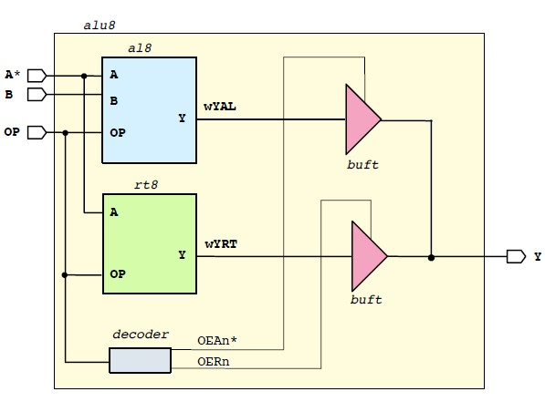
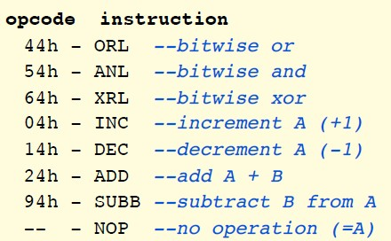
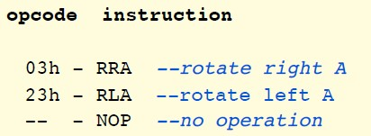
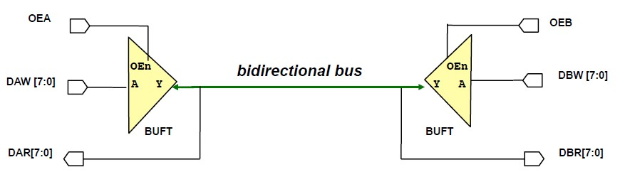

This repository is the design of an 8 bit ALU capable of calculating several arithmetic, logic and rotation operations.
It has following sub components
- The AL8 module processing arithmetic or logic instructions
- The RT8 module for the rotation operation
- The BUFT8 module which connects the AL8 and RT8 module to the common output port
- A decoder logic to decide the logic to be used - AL8/RT8
- A top level design that integrates all the components and testbench to simulate the result.

The overall schematic of the design is shown below.

In the Arithmetic and logic module or AL8 module the following opcodes are implemented.

In the shift register module or RT8 module the following opcodes are implemented.

The buffer module or BUFT8 module allows the connection of 8bit busses to the common bidirectional bus.
- when the output enable is low, the component should drive signal A to the output Y
- In other cases, it should set the output to the high impedance so that it will free the bus, will allows other members to write.

The application example of buffer is shown below

The decoder controls the signals from opcode and decides whether to perform the arithmetic operation or rotation operation.

