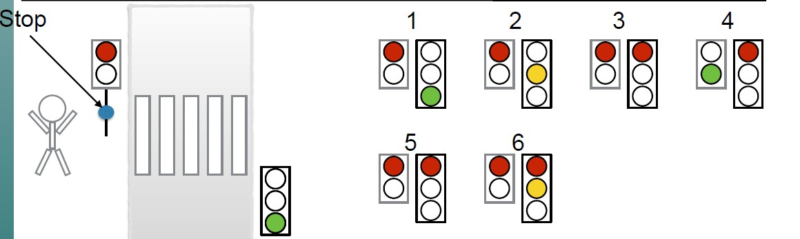

This repository contains a simple VHDL coding for the traffic light control system that control the signals for the vehicles and also the pedestrians.
So, this system has 3 inputs, clock, reset and the stop (manual stop pressed by the user) and 2 outputs traffic light for vehicles (t_light) and the pedestrian light (p_light).
The overview of the designed system is represented in the below schematic.

The finite state machine is used to implement this system. This system is designed with 6 states as represented in the above schematic. 
The state transition between different states is represented in the following diagram.

